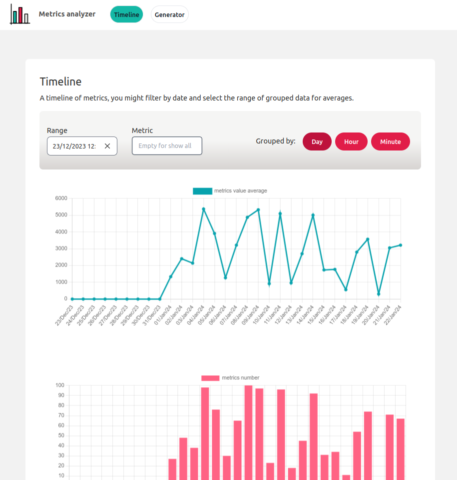
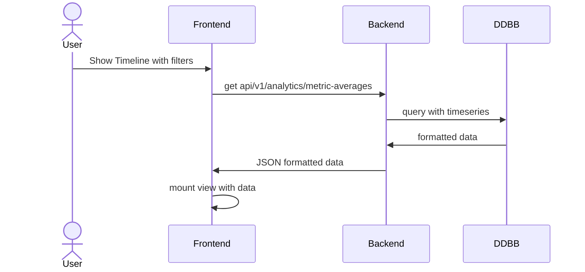
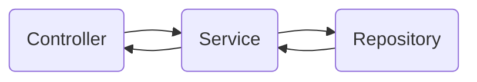
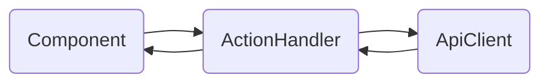

## Metrics Timeline

This project is an example of an application compounded by a frontend and backend for managing and visualizing metrics in a timeline. Metrics need to be saved in DDBB.

## About the implementation

The project has been developed with the following technologies:
- Backend:
  - Language: Ruby (3.1.1)
  - Framework: RubyOnRais (7.1.0)
  - DDBB: PostgreSql (13.4)
  - Tests: Rspec

- Frontend:
  - Language: Typescript
  - Framework: Vue (3.3.11)
  - Project management: Vite (5.08)
  - Tests: Vitest + vue/tests-utils
  - Charts: ChartJs

More about:
- [Backend README.md](backend/README.md)
- [Frontend README.md](frontend/README.md)

## Preview
This is a preview of the application:

## Decisions and trade-off

### Technologies

#### Why Rails?

I have used Rails with API installation because I feel very comfortable using it. I have added some extras to the project base, for instance, I like to use repositories to abstract access to data to the application. Although I have used ActiveRecord because of the time, I have considered not to use it. It will be the best decision if I need a change of database technology in the future. I have used namespaces to organize the data.

#### Why Vite + Typescript + Vue3?

I have decided on this stack because I know vue 3 well and I feel comfortable using it. I have used Vite instead of Webpack because it is simpler for example programs like this. Typescript lets me have typos and it is a good option for work in a secure way.

#### Tests in backend

I have used Rspec to write the tests in the backend with shoulda-matchers. I have created my factories instead of using FactoryBot Gem because I do not need more functionality. I have used Faker gem to generate fake info for tests.
The types of tests implemented have been:
- Integration tests: repositories, services
- Hybrid tests (all layers): controllers

#### Tests in frontend

I have used Vitest instead of Jest because it works better with Vite. The methods are mainly the same in both libraries. For Vue components, I have used @vue/test-utils to mount the component. I have not tested ActionHandlers or Stores because time.
The types of tests implemented have been:
- Unit tests: components

### Technical decisions

#### How does it work?
It is a simple frontend app with a backend connected to a database.

#### How to store data?

I have to store metrics data to show it later in a timeline. The first decision was whether could be the better DDBB for the purpose of SQL or NonSQL database. How do I know the structure of the metrics (timestamp, name and value) and
PostgreSQL let me obtain the time series of the data easily, so I decided to use it. Mongo indeed can scale well and with version 5 could work with time series, but I could do the same with PostgreSQL. Because of the time, I have not implemented a warehouse with a metric module to extract the information for each view, but it could be necessary in the future.

#### How to retrieve the data?

With PostgreSQL, I have created a query to get the data grouped by averages in days, hours and minutes. For days I have ned the timestamp to group the metrics correctly. I have also a filter to select the name of the metric to be retrieved.

#### How it will scale?

To improve speed in calculations, I use a query in the database without working with data in server memory. PostgreSQL can do the operation quickly. If it is not quick enough, I could use technologies like Timescale which is better for working with timescales in PostgreSQL.
I have not limited the range or the days in filters. It could be necessary if we want to prevent requests took many time.
About the data, the backend will send a JSON with an entry for each range. In the worst case (range in minutes), it will send 720 elements for a single day.
Frontend only has to represent the data sent for the backend.

#### Which type of API do I have to use (REST, GraphQL, ...)?

Like the data returned and the params of the filters are easy, I have decided to use a Rest API since Rails is prepared by default to work with it. Api will be versioned to improve the management of changes.

#### How to manage business logic in Backend?

For experience, I prefer not to use models in rails. I prefer to validate controller params in a service. A service is an object that would do only one action (like a command). It's like a domain-driven design. The flow of data has only one direction and it will prevent problems with logic used in more than one place.

#### How to manage business logic in Frontend?

In the frontend application, business logic will be stored in ActionHandlers. The ActionHandlers will be the only elements capable of calling the ApiServices and managing the responses.
Components will use ActionHandlers to access the transformed data.

#### Timeline representation

To show the timeline with data, I have decided to use ChartJs which is a modern chart library that works well with Vue. It library permits automatizing the representation of time ranges by automatically transforming the date-times to a specific format.

#### Why a framework for styles?

I have used a framework like Tailwind as it permits me to apply styles easily. I don't recommend frameworks for big applications, but for this case yes.

#### More stuff:

I have wanted to add the following but unfortunately, I have not more time:

- Corevage: tools for defining coverage
- More backend tests: tests for tasks
- More tests for front: unit tests for ActionHandlers
- UX: skeletons or loadings while fetching data
- Api documentation: API definition for swagger
- Postman collection: file for tests API in Postman
- Better timeline chart: maybe a better representation
- Responsive page: make responsive the application
